# SCRIPTING - Shell/Bash Scripting

## Tools Required :

* Visual Studio Code
* Git Bash /Terminal
* RedHat/ Ubuntu (Virtual machines)

=> Installation 
    
[Refer Here : 'https://www.youtube.com/watch?v=mRILfUNbsIo']

=> Creating of AWS EC2 instance

[Refer here : 'https://www.youtube.com/watch?v=me2s3mTNwGo']

### Example of Hello world!

* Take an Ubuntu machine and login to it
* Create a folder to write the scripts in one place
* Create a file _**helloworld.sh**_
```
#!/bin/bash

echo "Hello World!"
```
* Now execute the script using _bash_ _**bash helloworld.sh**_
```
mkdir scripts
cd scripts
vi helloworld.sh     # add script
bash helloworld.sh 
```
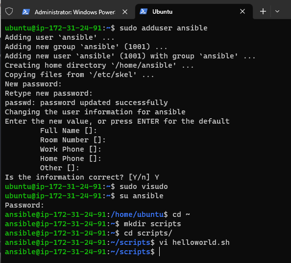

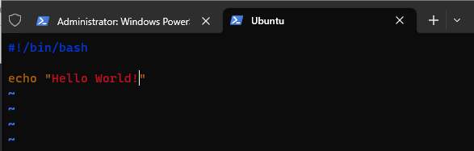

* Generally all the scripts will have `.sh` extension

### What is '#!/bin/bash' ?

* It is called as _**Shebang**_, which tells the linux system for which binary to be used for executing the script
* For example, `#!/bin/bash`- on bash prompt , `#!/usr/bin/python3`- on using python code

* Let's create a python script  
* Create a file _**helloworld.py**_
```
#!/usr/bin/python3

print("Hello World!")
```
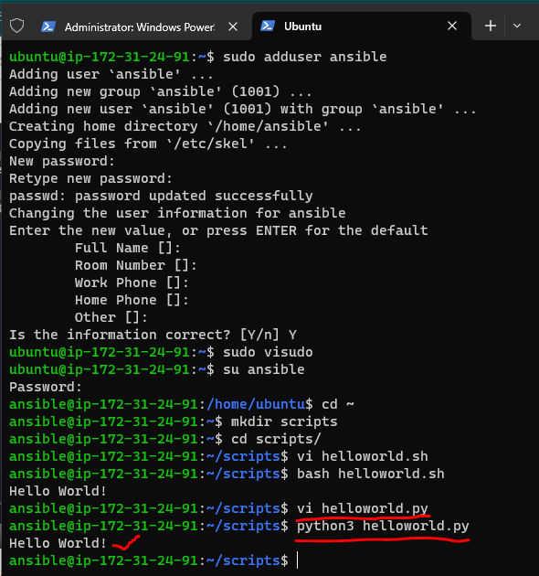

* Now execute the script using _python3_ _**python3 helloworld.py**_
```
mkdir scripts
cd scripts
vi helloworld.py     # add script
python3 helloworld.py 
```
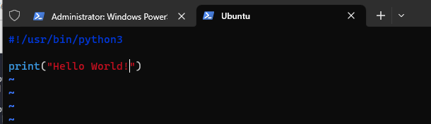

* To execute we used bash command, but even after having shebang why do we need bash command :
* To execute the scripts we need file permissions, so let's give file permissions
```
ls -l helloworld.sh
chmod +x helloworld.sh
ls -l helloworld.sh
./helloworld.sh
```
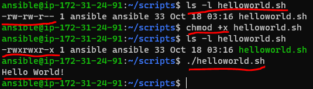

```
ls -l helloworld.py
chmod +x helloworld.py
ls -l helloworld.py
./helloworld.py
```
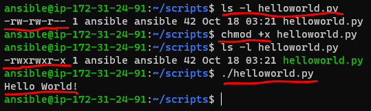

## Readability

* When writing, make sure the code is readable 
* The scripts are made with :
    * Comments
    * Verbosity

### Comments

* Comments is nothing more than bit of text explaining what you are doing
* In shell the character which we use to denote comments is _#_
```
#!/bin/bash

# Print the text to the terminal
echo "Hello World!"
```

 _**OR**_

```
#!/bin/bash

echo "Hello World!"  # Print the text to the terminal
```
* Script headers with fields :
    * Author
    * Version
    * Date
    * Description
    * Usage
```
#!/bin/bash

##################################################################### 
# Author: Harika
# Version: v1.0.0
# Date: Present
# Description: Sample shell script
# Usage: ./helloworld.sh
#####################################################################

# Print the text to the terminal
echo "Hello World!"
```
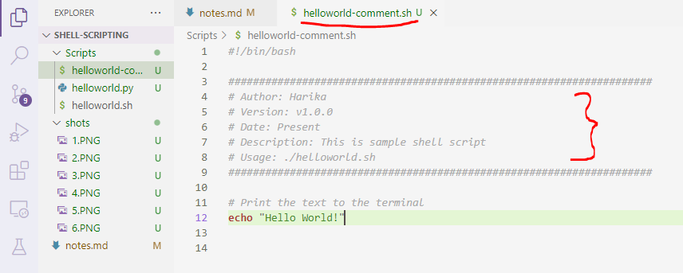

### Verbosity

* Balancing act between not too much but also too less explanation
* Types :
    * Verbosity in Comments : Ensure your comments are punctual and smaller
    * Verbosity in Commands : Ensure to use long variants in commands instead of single letter , e.g. ls --recursive instead of ls -R, where they both give same results and long variant is readable

    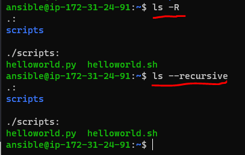
    
    * Verbosity in Command outputs : Build scripts that take two argument -v/-verbose and -q/-quiet. When user runs your script with verbose parameter give detailed information about what is happening & in other case don't display anything or display only absolutely required stuff to the terminal

#### SHELL SCRIPTING : Shell script is a sequence of linux commands that are to be executed in an order

### Variables and User Input

#### What is a variable ?

* Variable is a standard building block in scripting languages. They allow you to store information, so that we can retrieve/change multiple times during the execution of script.
* Assigning the value variable `<variable_name>=<variable_value>`
```
name="Quality Thoughts"
```
* Referencing the variable `${variable_name}` or `$variable_name`
```
echo $name
echo ${name}
echo "Name == ${name}"
```
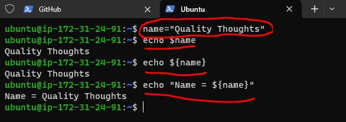

* Now let's try to create a simple shell script
```
#!/bin/bash

#####################################################################
# Author: Harika
# Version: v1.0.0
# Date: Present 
# Description: Shell script demonstrating variables
# Usage: ./variabledemo.sh
#####################################################################

name="Harika"
org_name="Quality Thoughts"

# Interpolating the variables
echo "This is ${name} from ${org_name}"

# All the variables are treated as text by linux until and unless you are explicit
number=5
echo $number + 1
```
* Now execute the script

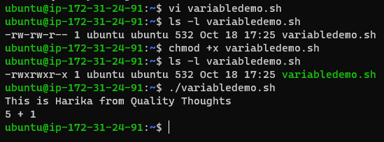
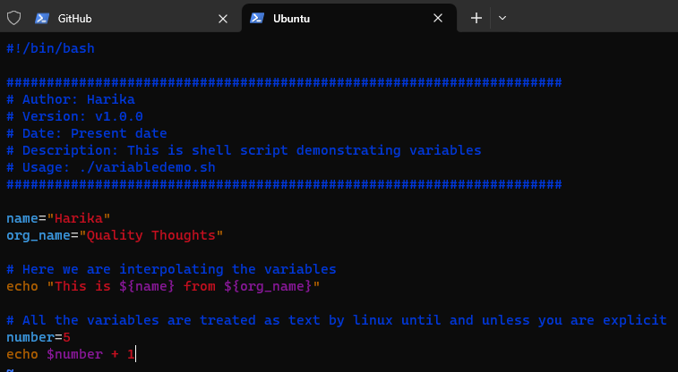

* Now shell script is treating numbers as text, if we want shell script to consider variable number as integer, we need to use and expression
```
$(( ${number} + 1 ))
```
* Now considering the script to be
```
#!/bin/bash

#####################################################################
# Author: Harika
# Version: v1.0.0
# Date: Present 
# Description: Shell script demonstrating variables
# Usage: ./variabledemo.sh
#####################################################################

name="Harika"
org_name="Quality Thoughts"

# Interpolating the variables
echo "This is ${name} from ${org_name}"

# All the variables are treated as text by linux until and unless you are explicit
number=5
echo $number + 1

echo "let's use arthimetic expression"
echo $(( ${number} + 1 ))
```
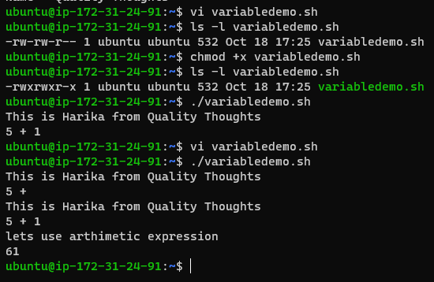


* In shell scripting we follow naming conventions, for

1. Variables : lowercase with underscores
```
my_number=6
message="how are you ?"
```
2. Constants : UPPERCASE
```
LOCATION="/home"
```
* Do not create variables with names which already have some meaning PATH, USER, LANG, SHELL, HOME & so on. If the purpose is similar, try to prefix 'SCRIPT_', for example define as shown below
```
SCRIPT_PATH over PATH
SCRIPT_USER over USER
```
* So far, we have been dealing with static scripts, so let’s introduce the concept of _User inputs_ in shell scripting

### Basic Inputs

* At a very basic level, everything you enter on the command line after the script can be used as input
```
./<script>.sh Hello
```
* Let's create a script called as _**printname.sh**_ with the following script
```
#!/bin/bash

#####################################################################
# Author: Harika
# Version: v1.0.0
# Date: Present 
# Description: Script demonstrates basic user inputs
# Usage: ./printname.sh <pass name>
#####################################################################
name=${1}
echo "Hello ${name}"

echo "0 = ${0}  1 = ${1}"
```
* Now execute the script

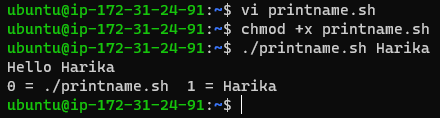
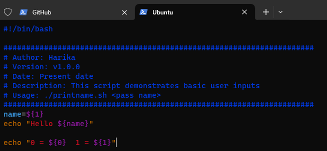

* Here ${1} stands for the _first positional argument_
* Generally we will have two kinds of arguments :

1. Positional arguments :
```
cp 1.txt 2.txt 

# 1.txt & 2.txt - positional arguments
```
2. Named arguments :

```
ping --count 4 google.com

# google.com - positional argument
# 4 - named argument as it is a value for the name called as count
```
* The script shown above is depending on positional arguments

### Positional arguments in shell scripts

* The arguments which are passed to the shell script after the filepath of shell becomes positional arguments
```
./myscript.sh 12 13
```
* Consider the above example
```
$0 = ./myscript.sh
$1 = 12
$2 = 13
```
* Let's develop a shell script which takes name and location as positional argument 1 and 2 and prints the _**positionalargdemo.sh**_
```
#!/bin/bash

#####################################################################
# Author: Harika
# Version: v1.0.0
# Date: Present
# Description: Script demonstrates positional arguments
# Usage: ./positionalargdemo.sh <name> <location>
# 1 positional argument is considered as name
# 2 positional argument is considered as location
#####################################################################

name=$1
location=$2

echo "Welcome ${name}, You come from ${location}. Welcome to Bash Scripting"
```
* Execution Result

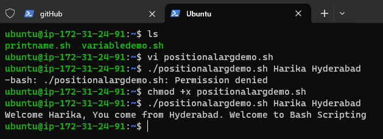
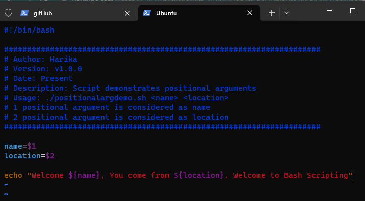
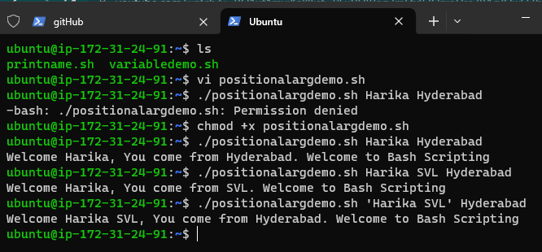

### Parameters & arguments

* Let's understand the terminology of parameter & arguments. They are slightly different
* Argument is something which you pass to a script.
* What you define in a script to hold argument value is parameter
* Let's write a simple script to demonstrate the difference _**argumentparameter.sh**_
```
#!/bin/bash

#####################################################################
# Author: Harika
# Version: v1.0.0
# Date: Present
# Description: Shell script demonstrating parameters and arguments
# Usage: ./argumentparameter.sh <arg-1> <arg-2>
#####################################################################

# Parameter is used to define argument value
parameter_1=$1

parameter_2=$2

echo "Parameter 1 is ${parameter_1}"

echo "Parameter 2 is ${parameter_2}"
```
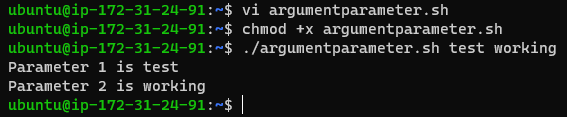
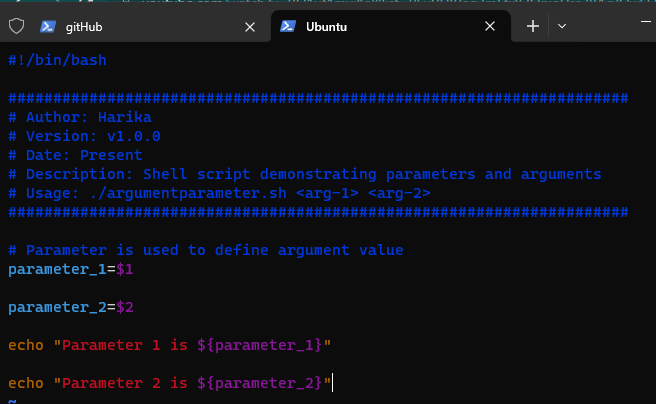
```
 $1-$9    Represent positional parameters for arguments one to nine
${10}-${n}    Represent positional parameters for arguments after nine
$0    Represent name of the script
$∗    Represent all the arguments as a single string
$@    Same as $∗, but differ when enclosed in (")
$#    Represent total number of arguments
$$    PID of the script
$?    Represent last return code
```
#### SHELL:

* A shell gives us an interface to the Unix system. While using an operating system, we indirectly interact with the shell. 
* On Linux distribution systems, each time we use a terminal, we interact with the shell. The job of the shell is to interpret or analyze the Unix commands given by users. 
* A shell accepts commands from the user and transforms them into a form that is understandable to the kernel. In other words, it acts as a mediator between the user and the kernel unit of the operating system.

#### NON-INTERACTIVE SHELL:

* As the name implies, a non-interactive shell is a type of shell that doesn’t interact with the user. We can run it through a script or similar. 
* Also, it can be run through some automated process. In this case  .bashrc and .profile files do not get executed. The 
non-interactive shell influences the PATH variable. 
* It is highly recommended to use the full path for a command in non-interactive shells. Non-interactive scripts can smoothly run in the background easily. 
* This shell is generally a non-login shell because the calling user has logged in already. A shell that runs a script is always considered a non-interactive shell.

#### INTERACTIVE SHELL:

* An interactive shell is defined as the shell that simply takes commands as input on tty from the user and acknowledges the output to the user. 
* This shell also reads startup files that occurred during activation and displays a prompt. It also enables job control by default. It is also clear from the name, it is a shell with which we can interact. 
* An interactive script is a script that requires input from the user. Interactive scripts couldn’t run in the background as they required input from the user.


* The scripts which we have developed so far are non-interactive scripts, because once you pass the values the execution happens
* Interactive scripts take inputs from users while executing
* Now let's look at a simple read command which reads the input from the user and stores in a variable called as _**REPLY**_
```
read 
hello
echo $REPLY
```
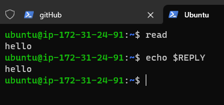

* Now let's execute one more simple variation of the read command
```
read -p "What is your name ?"
Harika
echo $REPLY
read -p "What is your name ?" my_name
Harika
echo $my_name
```
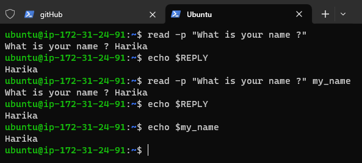

* Let's build some interactive script asking questions to the user _**interactivescriptdemo.sh**_
```
#!/bin/bash

#####################################################################
# Author: Harika
# Version: v1.0.0
# Date: Present
# Description: Shell script demonstrating interactive scripts
# Usage: ./interactivescriptdemo.sh
#####################################################################

read -p "Name a superhero which you like . " super_hero
read -p "Which movie has this role ? " movie_super_hero
read -p "What is your name ? " name
echo "Hi ${name}, Thanks for watching the movie ${movie_super_hero} and liking the character ${super_hero}"
```
* Now let's execute the script

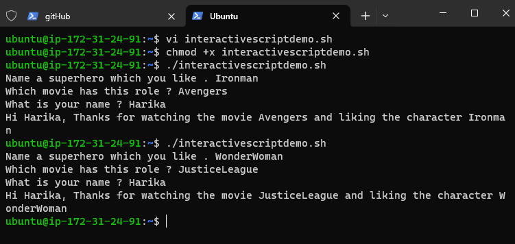
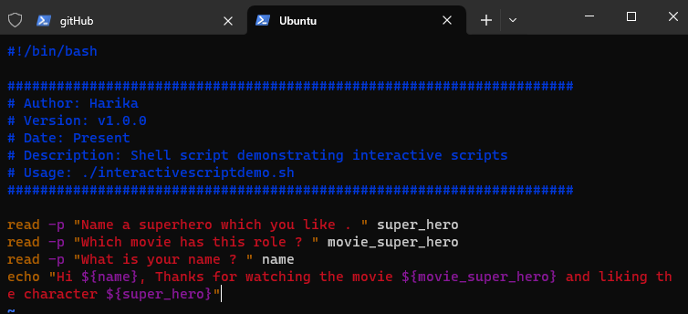

* Let's try to come up with script design which acts as a calculator by taking two values and operation as input
    * Script will be _**calculator.sh**_
    * Operations that will be supported are add,sub,mul,div
    * It should take two numbers to perform math

### Variable Scopes in Shell scripts

* Let's create two shell scripts

1. _**script1.sh**_
```
#!/bin/bash

name="Quality Thoughts"
echo "This is from script-1 name= ${name}"
./script2.sh
```
2. _**script2.sh**_
```
#!/bin/bash

echo "This is script-2"
echo "Value of name is ${name}"
```
* From script1 let's call script2 and try to see if the variable defined in script1 is available for use in script2
* let's execute _**script1.sh**_


* The value of name is not available in script2. The default scope of variable is the same script file.
* So let's find out if there is any other way to pass the variable from script1 to external scripts

1. Add arguments to script2
```
./script2.sh 
# replace this with
./script2.sh $name
```
2. Export the variable using _**export**_ statement in script1. so let's change script1.sh
```
#!/bin/bash

name="Quality Thoughts"
echo "This is from script-1 name= ${name}"
export name
./script2.sh
```
* Now execute _**script1.sh**_


### Debugging your scripts

* As the script grows and decision paths are included with conditional statements, we start using looping structures, etc 
* We may need some level of debugging to analyse the scripts
* This can be done as bash provides two options for us :
    * -v option
    * -x option
* Create a bash script _**debugdemo.sh**_ with the following content :
```
#!/bin/bash

echo "the zeroth argument is $(basename $0)"
echo "Hello $*"
```
* Now execute this script with the following command :
```
bash -v ./debugdemo.sh Harika SVL
```
* -v option displays the verbose output from bash
* -x option displays the commands, as they are executed and is most commonly used
* Now let's run the script
```
bash -x ./debugdemo.sh Harika SVL
```
* This shows how it is evaluated and helpful to know the decision branch that has been chosen by the script
* Install bash debug plugin in Visual Studio Code and we can debug the shell script
* Now we can debug the shell script
* This approach works with Visual Studio Code installed on the linux desktops or MAC.

### Enhancing interactive scripts

* Let's understand how to limit number of characters 
* so limit for number of characters to be entered, let's run the same command with one more option 
* Let's understand how to control visibility of entered text. If we request for sensitive content like pin/password etc, its not a good approach to show the text while user is typing, Shell gives an option of hiding text when the user is typing. This can be achieved by adding a _**-s**_ option to read command

### Next Steps:

* How to make my shell scripts understand options ? (Named Parameters)
```
./downloadfile.sh --url <>  --location-to-save /home/ubuntu/test.txt
```
