# SCRIPTING - Shell/Bash Scripting

## Tools Required :

* Visual Studio Code
* Git Bash /Terminal
* RedHat/ Ubuntu (Virtual machines)

=> Installation 
    
[Refer Here : 'https://www.youtube.com/watch?v=mRILfUNbsIo']

=> Creating of AWS EC2 instance

[Refer here : 'https://www.youtube.com/watch?v=me2s3mTNwGo']

### Example of Hello world!

* Take an Ubuntu machine and login to it
* Create a folder to write the scripts in one place
* Create a file _**helloworld.sh**_
```
#!/bin/bash

echo "Hello World!"
```
* Now execute the script using _bash_ _**bash helloworld.sh**_
```
mkdir scripts
cd scripts
vi helloworld.sh     # add script
bash helloworld.sh 
```


* Generally all the scripts will have `.sh` extension

### What is '#!/bin/bash' ?

* It is called as _**Shebang**_, which tells the linux system for which binary to be used for executing the script
* For example, `#!/bin/bash`- on bash prompt , `#!/usr/bin/python3`- on using python code

* Let's create a python script  
* Create a file _**helloworld.py**_
```
#!/usr/bin/python3

print("Hello World!")
```


* Now execute the script using _python3_ _**python3 helloworld.py**_
```
mkdir scripts
cd scripts
vi helloworld.py     # add script
python3 helloworld.py 
```


* To execute we used bash command, but even after having shebang why do we need bash command :
* To execute the scripts we need file permissions, so let's give file permissions
```
ls -l helloworld.sh
chmod +x helloworld.sh
ls -l helloworld.sh
./helloworld.sh
```


```
ls -l helloworld.py
chmod +x helloworld.py
ls -l helloworld.py
./helloworld.py
```


## Readability

* When writing, make sure the code is readable 
* The scripts are made with :
    * Comments
    * Verbosity

### Comments

* Comments is nothing more than bit of text explaining what you are doing
* In shell the character which we use to denote comments is _#_
```
#!/bin/bash

# Print the text to the terminal
echo "Hello World!"
```

 _**OR**_

```
#!/bin/bash

echo "Hello World!"  # Print the text to the terminal
```
* Script headers with fields :
    * Author
    * Version
    * Date
    * Description
    * Usage
```
#!/bin/bash

##################################################################### 
# Author: Harika
# Version: v1.0.0
# Date: Present
# Description: Sample shell script
# Usage: ./helloworld.sh
#####################################################################

# Print the text to the terminal
echo "Hello World!"
```


### Verbosity

* Balancing act between not too much but also too less explanation
* Types :
    * Verbosity in Comments : Ensure your comments are punctual and smaller
    * Verbosity in Commands : Ensure to use long variants in commands instead of single letter , e.g. ls --recursive instead of ls -R, where they both give same results and long variant is readable

    
    
    * Verbosity in Command outputs : Build scripts that take two argument -v/-verbose and -q/-quiet. When user runs your script with verbose parameter give detailed information about what is happening & in other case don't display anything or display only absolutely required stuff to the terminal

#### SHELL SCRIPTING : Shell script is a sequence of linux commands that are to be executed in an order

### Variables and User Input

#### What is a variable ?

* Variable is a standard building block in scripting languages. They allow you to store information, so that we can retrieve/change multiple times during the execution of script.
* Assigning the value variable `<variable_name>=<variable_value>`
```
name="Quality Thoughts"
```
* Referencing the variable `${variable_name}` or `$variable_name`
```
echo $name
echo ${name}
echo "Name == ${name}"
```


* Now let's try to create a simple shell script
```
#!/bin/bash

#####################################################################
# Author: Harika
# Version: v1.0.0
# Date: Present 
# Description: Shell script demonstrating variables
# Usage: ./variabledemo.sh
#####################################################################

name="Harika"
org_name="Quality Thoughts"

# Interpolating the variables
echo "This is ${name} from ${org_name}"

# All the variables are treated as text by linux until and unless you are explicit
number=5
echo $number + 1
```
* Now execute the script


* Now shell script is treating numbers as text, if we want shell script to consider variable number as integer, we need to use and expression
```
$(( ${number} + 1 ))
```
* Now considering the script to be
```
#!/bin/bash

#####################################################################
# Author: Harika
# Version: v1.0.0
# Date: Present 
# Description: Shell script demonstrating variables
# Usage: ./variabledemo.sh
#####################################################################

name="Harika"
org_name="Quality Thoughts"

# Interpolating the variables
echo "This is ${name} from ${org_name}"

# All the variables are treated as text by linux until and unless you are explicit
number=5
echo $number + 1

echo "let's use arthimetic expression"
echo $(( ${number} + 1 ))
```


* In shell scripting we follow naming conventions, for

1. Variables : lowercase with underscores
```
my_number=6
message="how are you ?"
```
2. Constants : UPPERCASE
```
LOCATION="/home"
```
* Do not create variables with names which already have some meaning PATH, USER, LANG, SHELL, HOME & so on. If the purpose is similar, try to prefix 'SCRIPT_', for example define as shown below
```
SCRIPT_PATH over PATH
SCRIPT_USER over USER
```
* So far, we have been dealing with static scripts, so let’s introduce the concept of _User inputs_ in shell scripting

### Basic Inputs

* At a very basic level, everything you enter on the command line after the script can be used as input
```
./<script>.sh Hello
```
* Let's create a script called as _**printname.sh**_ with the following script
```
#!/bin/bash

#####################################################################
# Author: Harika
# Version: v1.0.0
# Date: Present 
# Description: Script demonstrates basic user inputs
# Usage: ./printname.sh <pass name>
#####################################################################
name=${1}
echo "Hello ${name}"

echo "0 = ${0}  1 = ${1}"
```
* Now execute the script


* Here ${1} stands for the _first positional argument_
* Generally we will have two kinds of arguments :

1. Positional arguments :
```
cp 1.txt 2.txt 

# 1.txt & 2.txt - positional arguments
```
2. Named arguments :

```
ping --count 4 google.com

# google.com - positional argument
# 4 - named argument as it is a value for the name called as count
```
* The script shown above is depending on positional arguments

### Positional arguments in shell scripts

* The arguments which are passed to the shell script after the filepath of shell becomes positional arguments
```
./myscript.sh 12 13
```
* Consider the above example
```
$0 = ./myscript.sh
$1 = 12
$2 = 13
```
* Let's develop a shell script which takes name and location as positional argument 1 and 2 and prints the _**positionalargdemo.sh**_
```
#!/bin/bash

#####################################################################
# Author: Harika
# Version: v1.0.0
# Date: Present
# Description: Script demonstrates positional arguments
# Usage: ./positionalargdemo.sh <name> <location>
# 1 positional argument is considered as name
# 2 positional argument is considered as location
#####################################################################

name=$1
location=$2

echo "Welcome ${name}, You come from ${location}. Welcome to Bash Scripting"
```
* Execution Result


### Parameters & arguments

* Let's understand the terminology of parameter & arguments. They are slightly different
* _**Argument**_ is something which you pass to a script.
* What you define in a script to hold argument value is _**Parameter**_
* Let's write a simple script to demonstrate the difference : _**argumentparameter.sh**_
```
#!/bin/bash

#####################################################################
# Author: Harika
# Version: v1.0.0
# Date: Present
# Description: Shell script demonstrating parameters and arguments
# Usage: ./argumentparameter.sh <arg-1> <arg-2>
#####################################################################

# Parameter is used to define argument value
parameter_1=$1

parameter_2=$2

echo "Parameter 1 is ${parameter_1}"

echo "Parameter 2 is ${parameter_2}"
```


```
 $1-$9        Represent positional parameters for arguments one to nine
${10}-${n}    Represent positional parameters for arguments after nine
$0            Represent name of the script
$∗            Represent all the arguments as a single string
$@            Same as $∗, but differ when enclosed in (")
$#            Represent total number of arguments
$$            PID of the script
$?            Represent last return code
```
#### SHELL:

* A shell gives us an interface to the Unix system. While using an operating system, we indirectly interact with the shell
* On Linux distribution systems, each time we use a terminal, we interact with the shell. The job of the shell is to interpret or analyze the Unix commands given by users 
* A shell accepts commands from the user and transforms them into a form that is understandable to the kernel. In other words, it acts as a mediator between the user and the kernel unit of the operating system

#### NON-INTERACTIVE SHELL:

* As the name implies, a non-interactive shell is a type of shell that doesn’t interact with the user. We can run it through a script or similar. 
* Also, it can be run through some automated process. In this case  .bashrc and .profile files do not get executed. The 
non-interactive shell influences the PATH variable. 
* It is highly recommended to use the full path for a command in non-interactive shells. Non-interactive scripts can smoothly run in the background easily. 
* This shell is generally a non-login shell because the calling user has logged in already. A shell that runs a script is always considered a non-interactive shell.

#### INTERACTIVE SHELL:

* An interactive shell is defined as the shell that simply takes commands as input on tty from the user and acknowledges the output to the user. 
* This shell also reads startup files that occurred during activation and displays a prompt. It also enables job control by default. It is also clear from the name, it is a shell with which we can interact. 
* An interactive script is a script that requires input from the user. Interactive scripts couldn’t run in the background as they required input from the user.


* The scripts which we have developed so far are non-interactive scripts, because once you pass the values the execution happens
* Interactive scripts take inputs from users while executing
* Now let's look at a simple read command which reads the input from the user and stores in a variable called as _**REPLY**_
```
read 
hello
echo $REPLY
```


* Now let's execute one more simple variation of the read command
```
read -p "What is your name ?"
Harika
echo $REPLY
read -p "What is your name ?" my_name
Harika
echo $my_name
```


* Let's build some interactive script asking questions to the user _**interactivescriptdemo.sh**_
```
#!/bin/bash

#####################################################################
# Author: Harika
# Version: v1.0.0
# Date: Present
# Description: Shell script demonstrating interactive scripts
# Usage: ./interactivescriptdemo.sh
#####################################################################

read -p "Name a superhero which you like . " super_hero
read -p "Which movie has this role ? " movie_super_hero
read -p "What is your name ? " name
echo "Hi ${name}, Thanks for watching the movie ${movie_super_hero} and liking the character ${super_hero}"
```
* Now let's execute the script


* Let's try to come up with script design which acts as a calculator by taking two values and operation as input
    * Script will be _**calculator.sh**_
    * Operations that will be supported are add,sub,mul,div
    * It should take two numbers to perform math

### Variable Scopes in Shell scripts

* Let's create two shell scripts

1. _**script1.sh**_
```
#!/bin/bash

name="Quality Thoughts"
echo "This is from script-1 name= ${name}"
./script2.sh
```
2. _**script2.sh**_
```
#!/bin/bash

echo "This is script-2"
echo "Value of name is ${name}"
```
* From script1 let's call script2 and try to see if the variable defined in script1 is available for use in script2
* let's execute _**script1.sh**_ (cmd ./script1.sh)

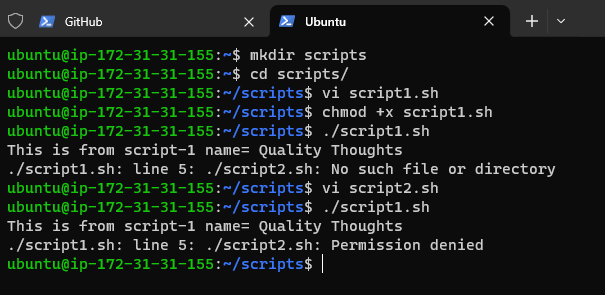

* The value of name is not available in script2. The default scope of variable is the same script file.
* So let's find out if there is any other way to pass the variable from script1 to external scripts

1. Add arguments to script2
```
./script2.sh 
# replace this with
./script2.sh $name
```
2. Export the variable using _**export**_ statement in script1. so let's change script1.sh
```
#!/bin/bash

name="Quality Thoughts"
echo "This is from script-1 name= ${name}"
export name
./script2.sh
```
* Now execute _**script1.sh**_

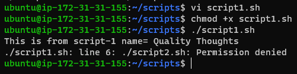

### Debugging your scripts

* As the script grows and decision paths are included with conditional statements, we start using looping structures, etc 
* We may need some level of debugging to analyse the scripts
* This can be done as bash provides two options for us :
    * -v option
    * -x option
* Create a bash script _**debugdemo.sh**_ with the following content :
```
#!/bin/bash

echo "The zeroth argument is $(basename $0)"
echo "Hello $*"
```
* -v option displays the verbose output from bash
* Now execute this script with the following command :
```
bash -v ./debugdemo.sh Harika 
```
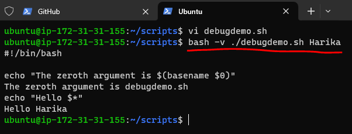

* -x option displays the commands, as they are executed and is most commonly used
* Now let's run the script with followig command :
```
bash -x ./debugdemo.sh Harika 
```
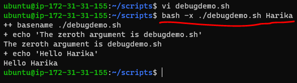

* This shows how it is evaluated and helpful to know the decision branch that has been chosen by the script
* Install _**bash debug**_ plugin in Visual Studio Code and we can debug the shell script

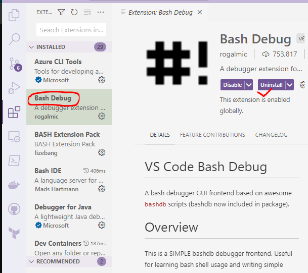

* Now we can debug the shell script

=> Run => Start Debugging => Run Debug

* This approach works with Visual Studio Code installed on the linux desktops or MAC.

### Enhancing interactive scripts

* Let's understand how to limit number of characters 

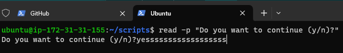

* so limit for number of characters to be entered, let's run the same command with one more option 

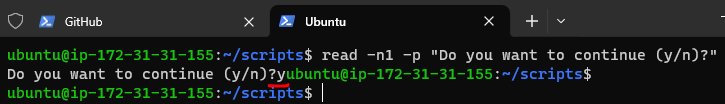

* Let's understand how to control visibility of entered text. If we request for sensitive content like pin/password etc, its not a good approach to show the text while user is typing
* So the shell gives an option of hiding text when the user is typing. This can be achieved by adding a _**-s**_ option to read command

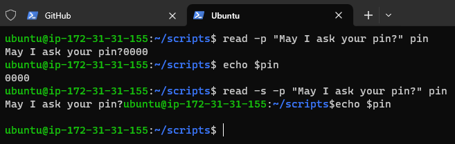

### Next Steps:

* How to make my shell scripts understand options ? (Named Parameters)
```
./downloadfile.sh --url <>  --location-to-save /home/ubuntu/test.txt
```
### Error Checking and Handling

* Topics :
    * Error checking
    * Error handling
    * Error Prevention
* The _**Exit status**_ (exit codes or return codes) is the way Bash communicates the successful or unsuccessful termination of a process to it's parent
* Linux command execution process :

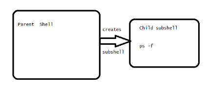
* Let's use _**mktemp**_ command
```
mktemp --help
```
* Let's write a script with `exit codes` for success & failure
```
#!/bin/bash

# Run a command with will always work
mktemp
# storing the exit code of mktemp
mktemp_ec=$?

# Run a command which always fails
mkdir /home/ubuntu
mkdir_ec=$?

echo "mktemp returned success exit code which ${mktemp_ec}"

echo "mkdir returned failure exit code which ${mkdir_ec}"
```
* Now execute this script 

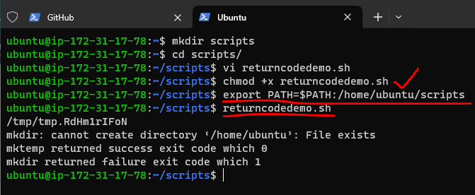

* Return code of `0` is _**success**_ any `other return code` is _**failure**_
* For the standard exit codes and their meanings 
[Refer here : https://tldp.org/LDP/abs/html/exitcodes.html ]

### Test Shorthand

* We use test command in lot of scripts, let's explore `test`command
* Directory checking
```
# full command
test -d <dirpath>

# short hand
[ -d <dirpath> ]
```
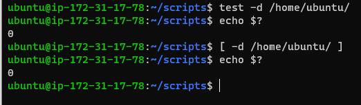

* Using test we can do comparisons using _**-gt**_ (greater than), _**-ne**_ (not equls), _**-eq**_ (equals), _**-lt**_ (less than)

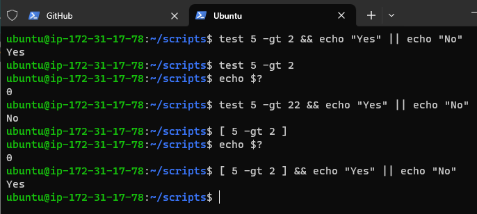

* To check the file existence use test _**-f**_ (file existence)

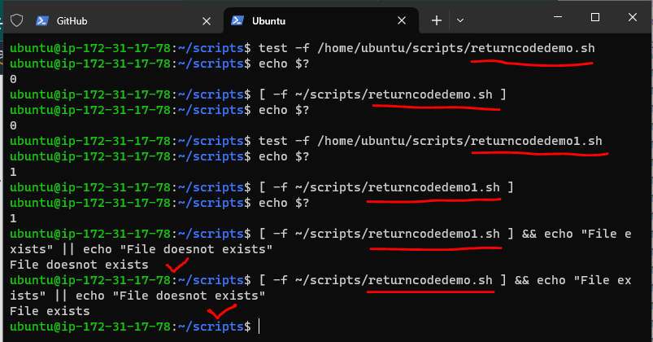

* So far we looked at how to check for directories, files and conditions which can act as error checks. If we combine this checks with conditional statements we can avoid errors.
* For handling errors also we need a _**Conditional Statements**_

### If-then-exit

* The basic idea is to test for a condition (`IF`), and if that condition is `true`, we do something (`THEN`) and if condition is `false` we return failure exit codes (`Exit`)
* We want to write a script which prints content of file
* let's write a basic _**if condition**_
```
if <condition> then
   statements
fi
```
* Using this let's write the script as shown below _**if-then-exitdemo.sh**_ 
```
#!/bin/bash

FILE=/tmp/random.txt

# Check if the file exits

if [[ -f ${FILE} ]]; then
   cat ${FILE}
   exit 0
fi

exit 1
```
* Now execute the script for negative test (/tmp/random.txt doesnot exist)

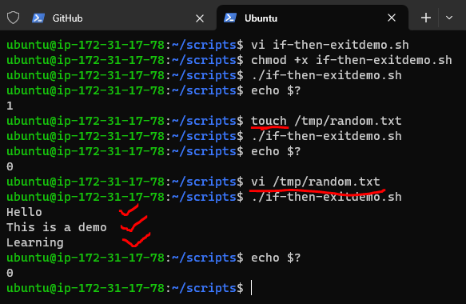

### Some examples of popular conditions

1. if [[ -f /tmp/file ]]; then do-something => do something if the file /tmp/file exists
2. if [[ ! -f /tmp/file ]]; then do-something => do something if the file /tmp/file does not exists
3. if [[ -n ${variable} ]]; then do-something => do something if the ${variable} is not empty
4. if [[ !-n ${variable} ]]; then do-something => do something if the ${variable} is empty
5. if [[ -z ${variable} ]]; then do-something => do something if the ${variable} is empty

### Applying above conditions to make script handle errors

* The _**if-then-rcdemo.sh**_ file will have a script
```
#!/bin/bash
mkdir temps
mkdir_rc=$?

# Test if the directory creation is success

if [[ ${mkdir_rc} -ne 0 ]]; then
    echo "mkdir didnot created the directory, so stopping script execution"
    exit 1
fi

touch temps/tempfile.txt
```
* Let's execute this script with a positive & negative condition

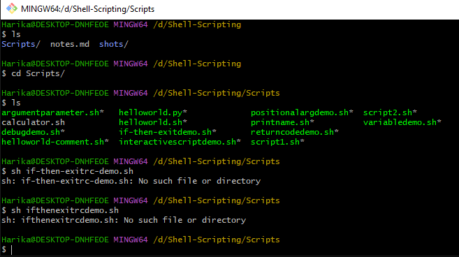

* So now let's adopt `if-then-else`
```
#!/bin/bash
FILE=randomfile.txt

# check if the file exists
if [[ ! -f ${FILE} ]]; then
    echo "File mentioned as ${FILE} doesn't exist so exiting"
    exit 1
else
    echo "Printing contents of file at ${FILE}"
    cat ${FILE}
fi
```
* Let's write one more `if-then-else` script which accepts parameters (positional parameters)
```
#!/bin/bash

### Usage ./ifthenelsedemo2.sh <path-of-file>

file_name=$1

# user might enter empty values
if [[ -z ${file_name} ]]; then
    echo "Incorrect usage: ./ifthenelsedemo2.sh <filename>"
    exit 1
fi

if [[ ! -f ${file_name} ]]; then
    echo "Please correct the file path and re-execute."
    exit 1
else
    echo "Contents of the file are"
    cat ${file_name}
fi
```
### Checking my arguments

* Let's try to write a very simple shell scrip which creates a specified file in the specified directory with specified content
* So argument list should be :
```
./createfile.sh <directory_path> <filename> <file contents>
```
* The script will be as shown below :
```
#!/bin/bash

####################################################################
# Author: harika
# Version: v1.0.0
# Date: Present
# Description: Demonstrates basic user inputs
# Usage: ./createfile.sh <directory-name> <file-name> <file-content>
#####################################################################

# We need three arguments, so checking if the arguments passed count
# is 3 or not

if [[ $# -ne 3 ]]; then
    echo "Incorrect number of arguments passed"
    echo "Usage: ./createfile.sh <directory-name> <file-name> <file-content>"
    exit 1
fi

# create parameters with argument values
directory_name=$1
file_name=$2
file_content=$3

# check if the directory exists, if it doesnot exist create directory

if [[ ! -d ${directory_name} ]]; then
    mkdir ${directory_name} || { echo "Cannot create directory"; exit 1; }
fi

# lets create absolute file path
abs_file_path=${directory_name}/${file_name}

# Try to create a file if the file doesnot exist
if [[ ! -f ${abs_file_path} ]]; then
    touch ${abs_file_path} || { echo "Cannot create a file"; exit 1; }
fi

# Since file is created or present add the contents to it
echo ${file_content} > ${abs_file_path}

```
* Now execute the script

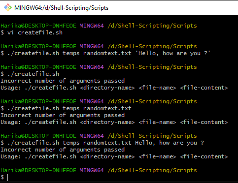

* In `Command Line usage` when arguments are in `<>` they are _**Required arguments**_ and if the arguments are in `[]` they are _**optional**_

### Dealing with y/n options in interactive scripts

* When we ask input from the user, user might enter many possibilities for yes (YES,yes,YeS,y,Y) and same for no.
* How can we write a script which is case sensitive to yes value ?
```
#!/bin/bash

read -p "Do you like linux? " reply

if [[ ${reply,,} = 'y' ]] || [[ ${reply^^} == 'YES' ]]
    echo "Great, Continue your learning journey"
    exit 0
fi
```
* ,, - for lower case

* ^^ - for upper case

### Special Parameters

* $0 $1 …
* $# : count the no.of arguments passed
* $-:
    * Create a simple script and execute _**specialparameters.sh**_
```
#!/bin/bash

echo "My shell used id $0 and the options passed are $-"
```
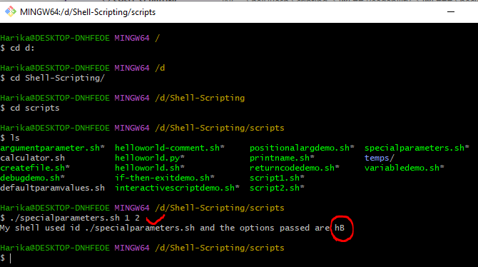

* Directly execute the following statement in terminal 
```
echo "My shell used id $0 and the options passed are $-"
```
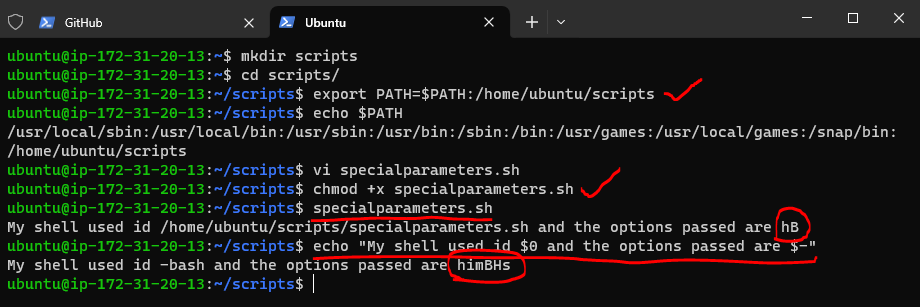

* The options set are as follows :
    * h : short for hash all
    * i : Shows it's interactive
    * m : short for monitor
    * B : allows brace expansion : “`mkdir dir{1,2}
    * H : allows history expansion of running commands

### Setting default values to parameters

* -z : Checks if the given string operand size is zero; if it is zero length, then it returns true.    [ -z $a ] is not true.
* -n : Checks if the given string operand size is non-zero; if it is non-zero length, then it returns true.    [ -n $a ] is not false.
* It's often a good practice to assign default values for non-critical parameters. See the below example and execute it
```
#!/bin/bash

#####################################################################
# Author: Harika
# Version: v1.0.0
# Date: Present
# Description: Demonstrates default values for 
# positional parameters
# Usage: ./defaultparamvalues.sh <name> <course>
#####################################################################


name=$1
course=$2

[ -z $name ] && name="Harika"
[ -z $course ] && course="Linux"

echo "Hello ${name}, Welcome to world of ${course} "
```
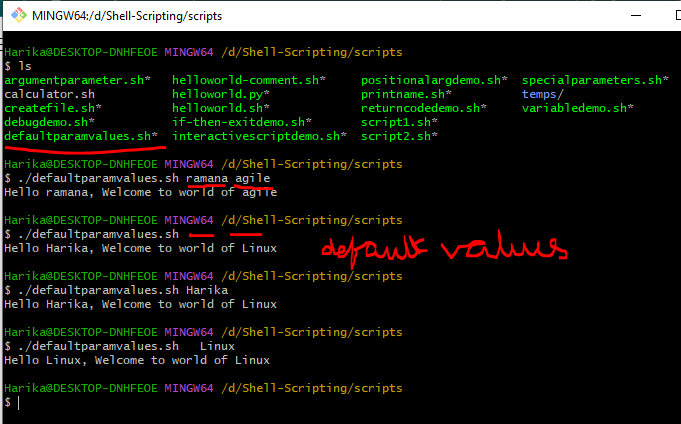

* There is an alternative syntax to assign default value to parameter (when already the parameters are declared and not assigned values)
```
${parameter-default}
```
* Let's apply this syntax to shell script
```
#!/bin/bash

#####################################################################
# Author: Harika
# Version: v1.0.0
# Date: Present
# Description: Demonstrates default values for 
# positional parameters
# Usage: ./defaultparamvalues.sh <name> <course>
#####################################################################


name=${1-"Harika"}
course=${2-"Linux"}

echo "Hello ${name}, Welcome to world of ${course} "

```
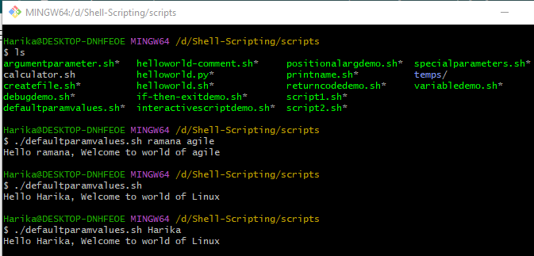

* If the parameter is declared and it has a null value
```
${parameter:-default}
```
### Looping constructs in bash scripting

* Let's try to understand :

    * For loops
    * Internal field separator
    * Counting directories & files
    * Nested Loops
    * Redirecting loop output
    * While and Until loops

* Sample for script
```
#!/bin/bash

# printing multiple courses
echo "DevOps"
echo "AWS"
echo "Azure"
echo "Linux"
echo "Windows"

echo "Now using for"

# with for loop
for course in DevOps AWS Azure Linux Windows ; do
   echo "${course}"
done

# other kind of for loop

echo "Now using for which is c-styled"
courses=(DevOps AWS Azure Linux Windows)

for (( index=0; index<5; index++ )) do
   echo "${courses[$index]}"
done
```
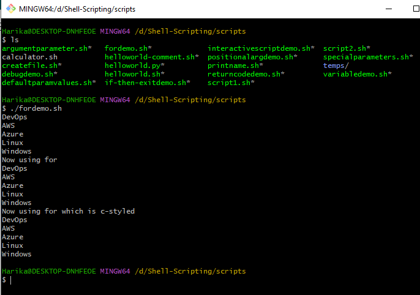

### Internal Field Separator

* By default the IFS value has one of (space, newline or tab)
* Let's assume you want to iterate over : _**text.txt**_
```
Hello, 
This is Linux
I'm fun to work with
```
* Now if we write the script to iterate and print over this content as shown below : _**ifs.sh**_
```
#!/bin/bash
file="text.txt"

for item in $(cat $file)
do
    echo "$item"
done
```
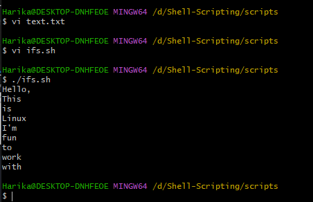

* What should be done to this script to iterate over lines? 
* Now add IFS=$’\n’ to the shell script _**ifs.sh**_ and this will do the trick 
```
#!/bin/bash
file="text.txt"
IFS=$'\n'
for item in $(cat $file)
do
    echo "$item"
done
```
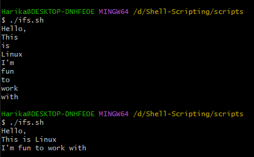

### Iterating through directories and files

* To do this we can write a very simple _**for loop**_
* Exercise: Find mistake in the following shell script
```
#!/bin/bash
echo "Directory path entered by user is /home/ubuntu/contents/*"
for path in "/home/ubuntu/contents/*";
do
    echo "processing ${path} "
    if [ -d "$path" ];
    then
        echo "${path} is directory"
    elif [ -f "$path" ];
    then
        echo "$path is file"
    fi
done
```
* where as this script is working
```
for file in /home/ubuntu/contents/*; do
        echo $file
done
```
* Try to find a way to reuse last commands output

### Nesting loops
```
#!/bin/bash
for (( row=1; row<=3; row++ ))
do
    
    for (( col=1; col<=3; col++ ))
    do
        echo "${row} * ${col}"
    done
done
```
* Redirecting loop output to a file
```
#!/bin/bash
for (( row=1; row<=3; row++ ))
do
    
    for (( col=1; col<=3; col++ ))
    do
        echo "${row} * ${col}"
    done >> rowscols.txt
done
```
### While and Until

* Example of While
```
$COUNT=20
while [ $COUNT -gt 0 ] ; 
do
    echo "$COUNT"
    (( COUNT-- ))

done;
```
* Another example for same logic
```
#!/bin/bash
COUNT=20
while [ "$COUNT" -gt 0 ] ; 
do
    echo "$COUNT"
    (( COUNT-- ))

done;
```
* Example Until loop
```
#!/bin/bash
COUNT=10
until (( COUNT < 0 )); do
    echo "$COUNT"
    (( COUNT-- ))
done
```
### Reading input from files

* Let's assume we have list of server ip addresses or hosts in the file called as _**servers.txt**_
* We are asked to find which servers are up
* This script is working, but it is unable to redirect the output to a text
```
#!/bin/bash

# Usage: ./checkservers <servers-filepath>
# servers-filepath is a text file with each server in new line

if [ ! -f "$1" ] ;
then
    echo "The input to $0 should be a file"
fi
echo "The following servers are up on $(date +%x)" > checkservers.out
while read server; 
do
    ping -c1 "$server"&& echo "Serverup $server" >> checkservers.out
done < $1

cat checkservers.out
```
### Building Blocks for reusability : Functions

* DRY principle (Don’t Repeat Yourself)
* We will cover the following aspects :
    * Introduction
    * Passing Parameters to the functions
    * Variable scope
    * Returning values from functions
    * Recursive functions
* Functions are internally represented as blocks of code in memory as named elements. These elements can be created within shell environment, as well as within the script execution.
* Execute `declare -F` in the bash. The output of this command might vary with distribution

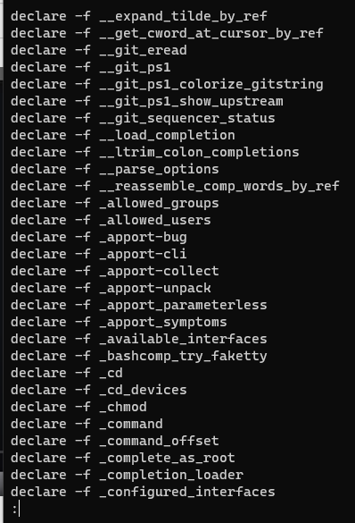

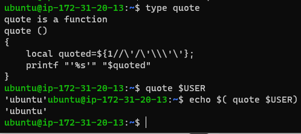

* Functions can be created using the following two syntaxes

* Syntax 1:
```
function-name() {
    <code to be executed>
}
```
* Syntax 2:
```
function <function-name> {
    <code to be executed>
}
```
* Let's start with a simple function
```
show_system_details() {
    echo "Uptime is"
    uptime
    echo "Cpu details"
    lscpu
    echo "User list"
    who
}

is_file() {
    if [ ! -f "$1" ]; then
        echo "$1 is not a file"
        exit 2
    fi
}

backup_file() {
    is_file "$1"
    new_file_loc="${1}.bak" 
    cp $1 $new_file_loc
    echo "file is copied to $new_file_loc"
}

backup_file "/home/ubuntu/1.txt"
```
#### Example : 1
```
#!/bin/bash

hello_world () {
   echo 'hello, world'
}

hello_world
```
#### Example : 
```
#!/bin/bash

num1='a'
num2='b'

alpha(){
num1='c'
num2='d'

echo first is $num1 and second is $num2

}

echo before $num1 and $num2

alpha

echo after $num1 and $num2
```
#### Example : 3
```
#!/bin/bash

my_function () {
  echo "some result"
  return 55
}

my_function
echo $?
```

### How to pass arrays to the functions ?

* Let's pass arguments to shell script which in turn passes array to the function
```
#!/bin/bash
display_array() {
    array=$@
    echo "The array inside the function is ${array[*]}" 
    for item in "$@"
    do
        echo "Argument is ${item}"
    done
}

test_input_1=(1 2 3 4 5)

for item in "${test_input_1[@]}"
do
    echo "External $item"
done

echo "The orginal array for test input 1 is ${test_input_1[*]}"
echo "Calling function"
display_array ${test_input_1[*]}
```
* Execute the following commands as shown below :

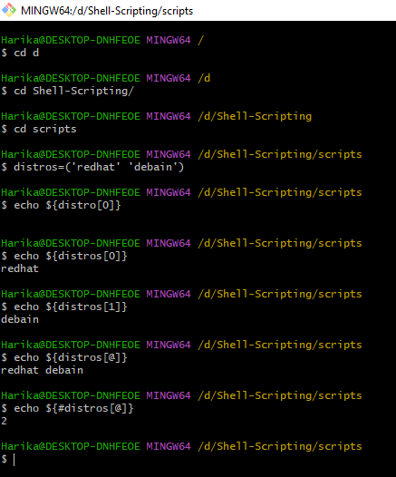

#### Example : 1
```
#!/bin/bash

var=(1 2 3 4 5)

echo ${var[@]}
```
#### Example : 2
```
#!/bin/bash

var=(1 2 3 4 5)

echo ${var[@]:1:3}
```
#### Example : 3
```
#!/bin/bash

work(){
        var=(1 2 3 4 5)
        echo ${var[@]}
}

work
```

### Variable scope

* By default, variables inside the function are _**Global Variables**_
```
#!/bin/bash

test_variable_1=10


testfunction() {
    test_variable_1=50
    test_variable_2=100
}

testfunction
echo "$test_variable_1"
echo "$test_variable_2"
``` 
* In shell, if your variable has to be local inside function, you have to explicit
```
#!/bin/bash

test_variable_1=10


testfunction() {
    test_variable_1=50
    test_variable_2=100
    local test_variable_3=200
    echo "Inside function: $test_variable_3"
}

testfunction
echo "$test_variable_1"
echo "$test_variable_2"
echo "Outside function: $test_variable_3"
```
#### Example : 1
```
#!/bin/bash

work(){
var=(1 2 3 4 5)
}

array(){
work
echo ${var[@]}
}

array
```
#### Exmple : 2
```
#!/bin/bash

work(){
        echo $(($num1+$num2))
}

array(){
num1=1
num2=2
work
}

array
```
### Returning values from functions

* Shell sample
```
#!/bin/bash
print_message() {
    input="$1"
    output="Message is ${input}"
    return $output
}

$reply=$print_message "1"}
echo $reply
```
* Try to fix the issue in above script to get the reply from function

* Using _**Global Variables**_

#### Example : 1
```
hello() {
var='Hello friend.'
echo "$var"
}

greeting=$(hello)
echo $greeting
```
#### Example : 2
```
hello() {
echo $1
}

greeting=$(hello "mybro")
echo $greeting
```
* Using _**Local Variable**_

#### Example :
```
#!/bin/bash
function first () {
  local x="HelloNew"
echo "Inside first function x=$x"

}

first
echo "Outside first function x = $x"

output:
Inside first function x=HelloNew
Outside first function x =
```
* Using _**Global Variable**_

#### Example :
```
#!/bin/bash
function first () {
x="Hello Geek"
echo "Inside first function x= $x"

}

first
echo "Outside first function x = $x"

output:
Inside first function x=Hello Geek
Outside first function x = Hello Geek
```
* Using _**Local & Global Variable**_

#### Example :
```
#!/bin/bash
first() {
local name="qt"
echo $name
surname="devops"
}

first
echo $name
echo $surname
```

### Returning Text from functions

* Look at the following script
```
#!/bin/bash
return_using_globalvar() {
    return_value="How are you"
}

print_message() {
    input="$1"
    echo "Message is ${input}"
    
}

return_text_by_echo() {
    input="$1"
    echo "Message is ${input}"
}

# solution 1: Using global variables
return_using_globalvar
echo "${return_value}"

# solution 2: Read the output
read -p "Enter your message "
return_test=$(return_text_by_echo "$REPLY")
echo "$return_test"
```
### Recursive Functions

* Function that `calls itself` is recursive functions
```
#!/bin/bash

calculate_factorial() {
    if [ $1 -eq 1 ]
    then
        echo 1
    else
        local var=$(( $1 - 1 ))
        local res=$(calculate_factorial $var)
        echo $(( $res * $1 ))
    fi

}

read -p "Enter a number: " val
factorial=$(calculate_factorial $val)
echo "Factorial of $val is: $factorial"
```
* Exercise :

1. Write a function to download a file from internet to desired location
```
download_item "<url>" "<location>"
```
2. Write a function to extract a tar file to a specific location
```
untar_file <tar_location> <extract_location>
```
### Regular Expressions

* They are also referred as regex, RegEx
* Truth about Regex:
    * Most of the cases regex is defined as ' A regular expression is a declarative specification of describing the textual structure to match string '
    * The problem with above definition is regular expressions are not `declarative`, but a regular expression is _**imperative**_ . Regular expression is `subroutine/function/method`

* In what language we write regular expressions ?
 *  In Regular expressions we have six major dialects :
     1. BRE :
        * Basic Regular Expressions
        * TOOLS : ed, sed, grep
     2. ERE :
        * GNU extended regular expressions
        * TOOLS & LANGUAGES : egrep, gawk, Notepad++, TCL
     3. EMACS :
        * Emacs regular expressions
        * TOOLS : Emacs
     4. VIM :
        * TOOLS : VIM
     5. PCRE :
        * PERL(5) compatible regular expressions
        * TOOLS & LANGUAGES : PERL, .NET, APACHE, C#, Java, JavaScript, PHP, Powershell, Python, R, Ruby,
     6. PSIX :
        * Perl 6 Regular Expressions
        * LANGUAGES : Perl 6

* These dialects have similarities & dissimilarities and also relationships b/w them

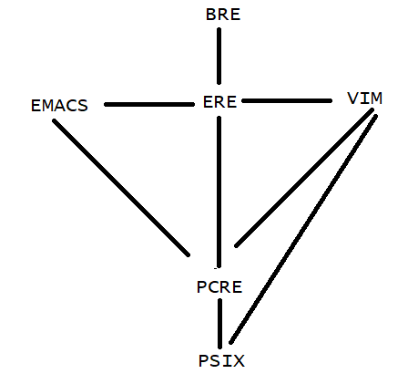

* How are regular expressions implemented ?

    * Theoretically `Regular expression` are implemented on a _**Finite State machine(FSM)**_. But languages practically implement regular expressions on `stack-based machine`.
    * To understand regular expressions we will be using _**FSM**_
    * For example, to search for a word cat in the text sequence in all six dialects mentioned above the regex is `/cat/`
    * Let's represent cat in transition graph


* If the above regular expression is represented by code
```
for(index=0; index<len(message); index++) {
    match_position = index

    try {

         message[match_position] == 'c' or throw Backtracking
         match_position++;

         message[match_position] == 'a' or throw Backtracking
         match_position++;

         message[match_position] == 't' or throw Backtracking
         match_position++;

        return TRUE;

    }
}
return FALSE;
``` 
### How are RegExe's Implemented ?

* Let's look at very simple regular expressions
* Use this website for understanding regex 
  
  [Refer here : https://regexr.com/ ]

* Let's look at a simple expression `/free/`

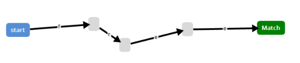

* Now let's try to write a expression `/free|fred/`
    * The possibilities in implementation are : 

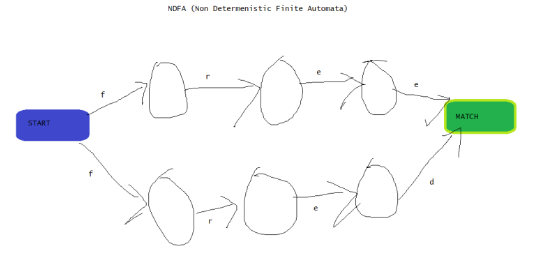

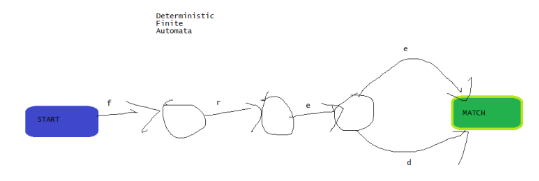

    
* RegExes use NDFA because of simple implementation
* In Regex every character is an instruction
* Now let's look at complex regex _abc|ab(s(t|e)|su)_

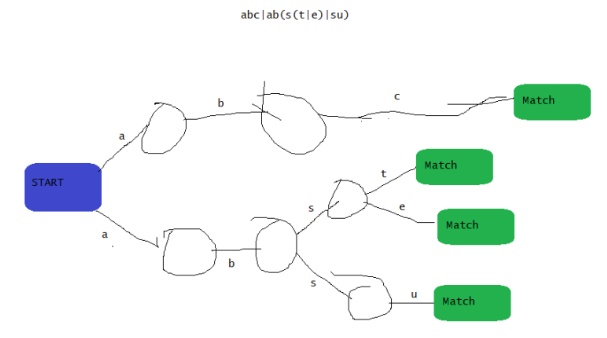

* Next Steps:

    1. Regex Instruction set

    2. Meta-syntax

    3. Control Structures

    4. Substring Extraction & Assertions

* Exercise:

    * Write a shell script to install chef server, for both redhat and ubuntu and use functions

[Refer here : https://docs.chef.io/server/install_server/#standalone ]

#### Regular Expression Instruction Set

* All the alphanumerics plus some punctuations are Instruction sets
* They would tell Regex engine to Match

#### Metasyntax  

* Is a special syntax given to characters and these characters have a special meaning depending on dialect you choose
```
* \ ^ $ . [ ( ) | + ? {
```

* ALTERNATION : This is how we specify the alternative paths generally represented by |

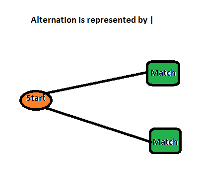

   * RANGES : Ranges specify the range characters
   * ESCAPE SEQUENCE : To match the character which is in metacharacter list just add a backslash `\`
   * CHARACTER CLASSES :

     * Word = \w
     * Not Word = \W
     * Digit = \d
     * Whitespace = \s

[Refer here : https://remram44.github.io/regex-cheatsheet/regex.html ]

* Greedy and Non-Greedy Regular expressions

### Next Steps

* What is a Capture Group?
* How to use regex in grep & sed

### Capture Groups

* Capture Groups are represented in parenthesis

### Refer the below websites

* https://regexr.com/
* https://remram44.github.io/regex-cheatsheet/regex.html

### Grep

* The grep command searches for a ``pattern of characters` in a file or multiple files
* Syntax
```
grep <token> filename
```


* In most cases we leverage piping concept of linux in using grep


* Meta characters in grep :
    1.  ^ : Beginning of line (anchor) ^ubuntu
    2.  : ending of line (anchor) ubuntu
    3.  . : any one character
        * : Zero or more characters
    4.  [] : Matches one in the character set
    5.  [^] : Matches one not in the character set
    6.  \w, \W, \b
* Grep supports Basic Regular expressions (BRE) by default and in Grep we can use Extended Regular expressions (GRE)
```
grep 'pattern' filname(s)   => Basic Regular Expression (BRE)
grep -G 'pattern' filname(s)   => Basic Regular Expression (BRE)
grep -E 'pattern' filename  => Extended regular Expressions (ERE)
grep -F 'pattern' file => No RE meta characters
```
* Classes :
   * [:alnum:] alphanumeric characters
   * [:alpha:]
   * [:cntrl:]
   * [:digit:]
   * [:lower:]
   * [:punct:]
   * [:upper:]
   * [:space:]
* Let's take this as an example :
```
northwest	nw		John Cena		34		3.5
west		we		Big Show		43		1.5
southwest	sw		Roman Reigns	28		2.5
northeast	ne		Becky Lync		26		4.5
```
* Using grep to match all lines with `nw`


* Find all the lines which begin with `n` => cat sales.dat| grep '^n'
* Find all the lines that contain `.5` in it =


* Download some sample 

[From here : https://excelbianalytics.com/wp/ ]
* We are using 1000 samples
```
Region,Country,Item Type,Sales Channel,Order Priority,Order Date,Order ID,Ship Date,Units Sold,Unit Price,Unit Cost,Total Revenue,Total Cost,Total Profit
Middle East and North Africa,Libya,Cosmetics,Offline,M,10/18/2014,686800706,10/31/2014,8446,437.20,263.33,3692591.20,2224085.18,1468506.02
North America,Canada,Vegetables,Online,M,11/7/2011,185941302,12/8/2011,3018,154.06,90.93,464953.08,274426.74,190526.34
Middle East and North Africa,Libya,Baby Food,Offline,C,10/31/2016,246222341,12/9/2016,1517,255.28,159.42,387259.76,241840.14,145419.62
Asia,Japan,Cereal,Offline,C,4/10/2010,161442649,5/12/2010,3322,205.70,117.11,683335.40,389039.42,294295.98
Sub-Saharan Africa,Chad,Fruits,Offline,H,8/16/2011,645713555,8/31/2011,9845,9.33,6.92,91853.85,68127.40,23726.45
Europe,Armenia,Cereal,Online,H,11/24/2014,683458888,12/28/2014,9528,205.70,117.11,1959909.60,1115824.08,844085.52
Sub-Saharan Africa,Eritrea,Cereal,Online,H,3/4/2015,679414975,4/17/2015,2844,205.70,117.11,585010.80,333060.84,251949.96
Europe,Montenegro,Clothes,Offline,M,5/17/2012,208630645,6/28/2012,7299,109.28,35.84,797634.72,261596.16,536038.56
Central America and the Caribbean,Jamaica,Vegetables,Online,H,1/29/2015,266467225,3/7/2015,2428,154.06,90.93,374057.68,220778.04,153279.64
```
* Match all the lines which start with vowel using extented grep
```
cat sales.csv | grep -E '^[AEIOU]'
cat sales.csv | egrep '^[AEIOU]'
```


