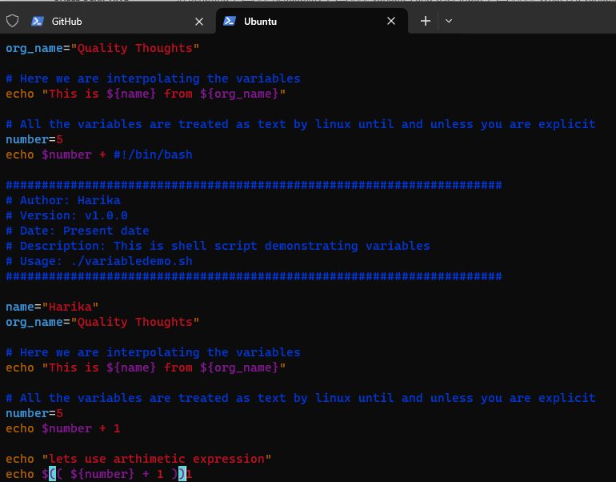

# SCRIPTING - Shell/Bash Scripting

## Tools Required :

* Visual Studio Code
* Git Bash /Terminal
* RedHat/ Ubuntu (Virtual machines)

=> Installation 
    
[Refer Here : 'https://www.youtube.com/watch?v=mRILfUNbsIo']

=> Creating of AWS EC2 instance

[Refer here : 'https://www.youtube.com/watch?v=me2s3mTNwGo']

### Example of Hello world!

* Take an Ubuntu machine and login to it
* Create a folder to write the scripts in one place
* Create a file _**helloworld.sh**_
```
#!/bin/bash

echo "Hello World!"
```
* Now execute the script using `bash` _**bash helloworld.sh**_
```
mkdir scripts
cd scripts
vi helloworld.sh     # add script
bash helloworld.sh 
```


* Generally all the scripts will have `.sh` extension

### What is '#!/bin/bash' ?

* It is called as _**Shebang**_, which tells the linux system for which binary to be used for executing the script
* For example, `#!/bin/bash`- on bash prompt , `#!/usr/bin/python3`- on using python code

* Let's create a python script  
* Create a file _**helloworld.py**_
```
#!/usr/bin/python3

print("Hello World!")
```


* Now execute the script using `python3` _**python3 helloworld.py**_
```
mkdir scripts
cd scripts
vi helloworld.py     # add script
python3 helloworld.py 
```


* To execute we used bash command, but even after having shebang why do we need bash command :
* To execute the scripts we need file permissions,so let's give file permissions
```
ls -l helloworld.sh
chmod +x helloworld.sh
ls -l helloworld.sh
./helloworld.sh
```


```
ls -l helloworld.py
chmod +x helloworld.py
ls -l helloworld.py
./helloworld.py
```


## Readability

* When writing,aim to make sure the code is as readable as possible
* The scripts are made so :
    * Comments
    * Verbosity

### Comments

* Comments is nothing more than bit of text explaining what you are doing
* In shell the character which we use to denote comments is _**#**_
```
#!/bin/bash

# Print the text to the terminal
echo "Hello World!"
```

 _**OR**_

```
#!/bin/bash

echo "Hello World!"  # Print the text to the terminal
```
* Script headers with fields :
    * Author
    * Version
    * Date
    * Description
    * Usage
```
#!/bin/bash

##################################################################### 
# Author: Harika
# Version: v1.0.0
# Date: Present
# Description: This is sample shell script
# Usage: ./helloworld.sh
#####################################################################

# Print the text to the terminal
echo "Hello World!"
```


### Verbosity

* Balancing act between not too much but also too less explanation
* Types :
    * Verbosity in Comments : ensure your comments are punctual and smaller
    * Verbosity in Commands : ensure to use long variants in commands instead of single letter , e.g. ls --recursive instead of ls -R, where they both give same results and long variant is readable

    
    
    * Verbosity in Command outputs : Build scripts that take two argument -v/-verbose and -q/-quiet. When user runs your script with verbose parameter give detailed information about what is happening & in other case don't display anything or display only absolutely required stuff to the terminal

#### SHELL SCRIPTING : Shell script is a sequence of linux commands that are to be executed in an order

### Variables and User Input

#### What is a variable ?

* Variable is a standard building block in scripting languages, They allow you to store information, so that we can retrieve/change multiple times during the execution of script.
* Assigning the value variable `<variable_name>=<variable_value>`
```
name="Quality Thoughts"
```
* Referencing the variable `${variable_name}` or `$variable_name`
```
echo $name
echo ${name}
echo "Name == ${name}"
```


* Now let's try to create a simple shell script
```
#!/bin/bash

#####################################################################
# Author: Harika
# Version: v1.0.0
# Date: Present date
# Description: This is shell script demonstrating variables
# Usage: ./variabledemo.sh
#####################################################################

name="Harika"
org_name="Quality Thoughts"

# Here we are interpolating the variables
echo "This is ${name} from ${org_name}"

# All the variables are treated as text by linux until and unless you are explicit
number=5
echo $number + 1
```
* Now execute the script


* Now shell script is treating numbers as text, if we want shell script to consider variable number as integer, we need to use and expression
```
$(( ${number} + 1 ))
```
* Now considering the script to be
```
#!/bin/bash

#####################################################################
# Author: Harika
# Version: v1.0.0
# Date: Present date
# Description: This is shell script demonstrating variables
# Usage: ./variabledemo.sh
#####################################################################

name="Harika"
org_name="Quality Thoughts"

# Here we are interpolating the variables
echo "This is ${name} from ${org_name}"

# All the variables are treated as text by linux until and unless you are explicit
number=5
echo $number + 1

echo "lets use arthimetic expression"
echo $(( ${number} + 1 ))
```



* In shell scripting we following naming conventions, for
    * variables: lowercase with underscores
```
my_number=6
message="how are you ?"
```
* Constants: UPPERCASE
```
LOCATION="/home"
```
* Do not create variables with names which already have some meaning PATH, USER, LANG, SHELL, HOME & so on. If the Purpose is similar try to prefix SCRIPT_, for example define as shown below.
```
SCRIPT_PATH over PATH
SCRIPT_USER over USER
```
* So far, we have been dealing with static scripts, so let’s introduce the concept of _user inputs_ in shell scripting

### Basic Inputs

* At a very basic level, everything you enter on the command line after the script can be used as input
```
./<script>.sh Hello
```
* Let's create a script called as `printname.sh` with the following script
```
#!/bin/bash

#####################################################################
# Author: Harika
# Version: v1.0.0
# Date: Present date
# Description: This script demonstrates basic user inputs
# Usage: ./printname.sh <pass name>
#####################################################################
name=${1}
echo "Hello ${name}"

echo "0 = ${0}  1 = ${1}"
```
* Now execute the script


* Here ${1} stands for the _first positional argument_
* Generally we will have two kinds of arguments :

   1. Positional arguments
```
cp 1.txt 2.txt 
# 1.txt & 2.txt are two positional arguments
```
   2. Named arguments

```
ping --count 4 google.com
# google.com is a positional argument
# where as 4 is a named argument as it is a value for the name called as count
```
* The script shown above is depending on positional arguments

### Positional arguments in shell scripts

* The arguments which are passed to the shell script after the filepath of shell becomes positional arguments
```
./myscript.sh 12 13
```
* The above example consider
```
$0 = ./myscript.sh
$1 = 12
$2 = 13
```
* Lets develop a shell script which takes name and location as positional argument 1 and 2 and prints the 
```
#!/bin/bash

#####################################################################
# Author: Shaik Khaja Ibrahim
# Version: v1.0.0
# Date: 26-Aug-2020
# Description: This script demonstrates positional arguments
# Usage: ./positionalargdemo.sh <name> <location>
# 1 positional argument is considered as name
# 2 positional argument is considered as location
#####################################################################

name=$1
location=$2

echo "Welcome ${name}, You come from ${location}. Welcome to Bash Scripting"
```
* Execution Result

### Parameters & arguments

* Lets understand the terminology of parameter & arguments. They are slightly different
* Argument is something which you pass to a script.
* What you define in a script to hold argument value is parameter
* Lets write a simple script to demonstrate the difference
```
#!/bin/bash

#####################################################################
# Author: Shaik Khaja Ibrahim
# Version: v1.0.0
# Date: 25-Aug-2020
# Description: This is shell script demonstrating parameters and arguments
# Usage: ./argumentparameter.sh <arg-1> <arg-2>
#####################################################################

# parameter is used to define argument value
parameter_1=$1

parameter_2=$2

echo "Parameter 1 is ${parameter_1}"

echo "Parameter 2 is ${parameter_2}"
```
* The scripts which we have developed so far are non-interactive scripts, because once you pass the values the execution happens
* Interactive scripts take inputs from users while executing
* Now lets look at a simple read command which reads the input from the user and stores in a variable called as REPLY
* Now lets execute one more simple variation of the read command
* Lets build some interactive script asking questions to the user
```
#!/bin/bash

#####################################################################
# Author: Shaik Khaja Ibrahim
# Version: v1.0.0
# Date: 26-Aug-2020
# Description: This is shell script demonstrating interactive scripts
# Usage: ./interactivescriptdemo.sh
#####################################################################

read -p "Name a superhero which you like? " super_hero
read -p "Which movie has this role? " movie_super_hero
read -p "What is your name? " name
echo "Hi ${name}, Thanks for watching movie ${movie_super_hero} and liking the character ${super_hero}"
```
* Now lets execute the script
* Lets try to come up with script design which acts as a calculator by taking two values and operation as input?
    * Script will be calculator.sh
    * Operations that will be supported are add,sub,mul,div
    * It should take two numbers to perform math.